

<picture>
    <source srcset="https://imgur.com/5bYAzsb.png" media="(prefers-color-scheme: dark)">
    <source srcset="https://imgur.com/Os03JoE.png" media="(prefers-color-scheme: light)">
    
</picture>

<h3>Curso de Robótica 2026-I</h3>
<h1>Laboratorio No. 1</h1>
<h2>Robótica Industrial: Trayectorias, entradas y salidas digitales</h2>
<h3>ABB IRB 140 · RobotStudio</h3>

<h4>Profesores: Pedro Fabián Cárdenas Herrera · Manuel Felipe Carranza Montenegro</h4>
<h4>Estudiantes: Janan Libardo Carreño Riaño · Cristian Stiven Hoyos Peralta · Jose Andres Zapata Piñeros</h4>

  
  
  
  

---

  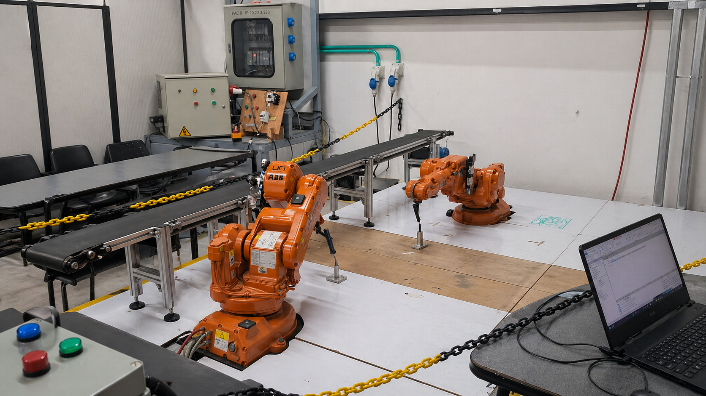
   <em>Celda de manufactura y robot manipulador ABB IRB 140</em>

---

## Tabla de contenido

1. [Introducción](#1-introducción)
   - [1.1 Planteamiento del problema](#11-planteamiento-del-problema)
   - [1.2 Descripción general de la solución](#12-descripción-general-de-la-solución)
2. [Diseño de la herramienta](#2-diseño-de-la-herramienta)
   - [2.1 Definición y parámetros de la herramienta](#21-definición-y-parámetros-de-la-herramienta)
   - [2.2 Modelado en Fusion 360 (herramienta + marcador)](#22-modelado-en-fusion-360-herramienta--marcador)
   - [2.3 Herramienta física montada en el robot](#23-herramienta-física-montada-en-el-robot)
   - [2.4 Planos de la herramienta](#24-planos-de-la-herramienta)
3. [Modelado del objeto de trabajo](#3-modelado-del-objeto-de-trabajo)
   - [3.1 Diseño y medidas de la caja (torta virtual)](#31-diseño-y-medidas-de-la-caja-torta-virtual)
4. [Configuración en RobotStudio](#4-configuración-en-robotstudio)
   - [4.1 Definición del TCP y Wobj](#41-definición-del-tcp-y-wobj)
   - [4.2 Definición de Targets y trayectorias](#42-definición-de-targets-y-trayectorias)
5. [Programación en RAPID](#5-programación-en-rapid)
   - [5.1 Descripción de las funciones utilizadas](#51-descripción-de-las-funciones-utilizadas)
   - [5.2 Lógica del programa (nombres + Pacman)](#52-lógica-del-programa-nombres--pacman)
   - [5.3 Código RAPID](#53-código-rapid)
6. [Automatización y control](#6-automatización-y-control)
   - [6.1 Smart Components (movimiento de la cinta)](#61-smart-components-movimiento-de-la-cinta)
   - [6.2 Station Logic y lógica de tablero](#62-station-logic-y-lógica-de-tablero)
7. [Diagrama de flujo de acciones del robot](#7-diagrama-de-flujo-de-acciones-del-robot)
8. [Simulación y resultados](#8-simulación-y-resultados)
   - [8.1 Plano de planta](#81-plano-de-planta)
   - [8.2 Verificación de la simulación en RobotStudio](#82-verificación-de-la-simulación-en-robotstudio)
   - [8.3 Resultados obtenidos](#83-resultados-obtenidos)

---

## 1. Introducción

### 1.1 Planteamiento del problema

Este laboratorio aborda la automatización de un proceso inspirado en la industria de alimentos, enfocado específicamente en la decoración de una torta virtual. El objetivo principal es sustituir el trabajo manual por un sistema programado que garantice mayor precisión, control y repetibilidad. Para lograrlo, se emplea un manipulador industrial ABB IRB 140 junto con un controlador IRC5, encargados de ejecutar trayectorias precisas sobre una superficie plana para escribir los nombres de los integrantes del equipo y trazar una figura decorativa, utilizando una herramienta diseñada especialmente para esta tarea.

El proyecto requiere la aplicación de conceptos fundamentales de robótica industrial, incluyendo la calibración de herramientas, la programación en lenguaje RAPID y la generación de trayectorias. Asimismo, el sistema integra el uso de entradas y salidas digitales para lograr una coordinación sincronizada entre el robot y una banda transportadora. Todo este entorno de trabajo se modela, analiza y valida previamente mediante el software de simulación RobotStudio, lo que permite asegurar el correcto funcionamiento de los componentes en un entorno virtual antes de su ejecución física.

**Especificaciones y restricciones del sistema:**

| Parámetro | Valor |
|-----------|-------|
| Tamaño de la torta | ~20 personas |
| Rango de velocidades | 100 – 1000 (unidades RAPID) |
| Tolerancia máxima en Z | ±10 mm |
| Tipo de movimiento | Trazo continuo |
| Posición inicial/final | Home |
| Decoración requerida | Nombres + figura adicional (Pacman) |

### 1.2 Descripción general de la solución

El desarrollo de la solución se ejecutó siguiendo una metodología secuencial, partiendo desde el diseño de los elementos hasta la simulación y posterior validación física: diseño de la herramienta y el objeto de trabajo en Fusion 360, configuración del entorno en RobotStudio (TCP, Wobj y Targets), programación en RAPID, implementación de Smart Components y lógica de E/S, y finalmente validación mediante simulación y pruebas físicas con el controlador IRC5.

---

## 2. Diseño de la herramienta

### 2.1 Definición y parámetros de la herramienta

El primer paso consistió en desarrollar un efector final adaptado a las medidas del flange del ABB IRB 140. **Criterios fundamentales del diseño:**

- **Fijación mecánica** – La herramienta se asegura con **tornillos** al flange del robot, respetando los planos técnicos del IRB 140.
- **Evitar singularidades** – El eje del marcador **no es colineal** con el eje del flange. Se adoptó una rotación de **45° en el plano horizontal**.
- **Compensación de errores** – El marcador **no se fija de forma rígida**. Se incorporó un **sistema de resorte** que permite una **tolerancia axial de 20 mm**, absorbiendo desviaciones de calibración o irregularidades de la superficie.

> **Material de fabricación:** PETG (resistencia y durabilidad) mediante impresión 3D.

### 2.2 Modelado en Fusion 360 (herramienta + marcador)
 
La pieza fue modelada en **Autodesk Fusion 360** y fabricada mediante impresión 3D en **PETG**. Una vez lista, la geometría se exportó en formato `.SAT`, permitiendo que RobotStudio la reconociera correctamente para acoplarla al manipulador en el entorno virtual.
 

  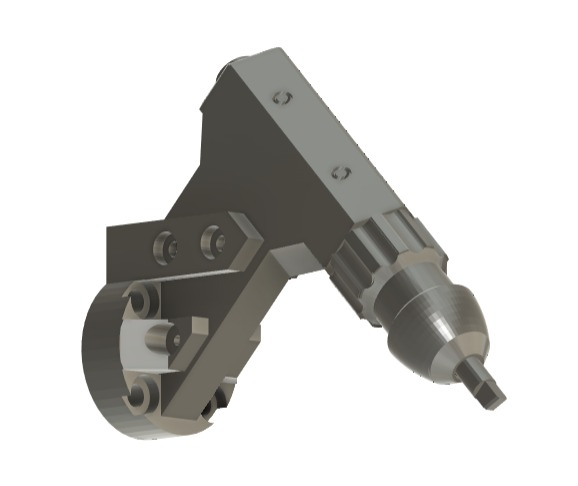
   <em>Figura 1. Modelado de la herramienta en Fusion 360</em>

----

👉 **[Planos Herramienta completo](./Planos_Herramienta.md)**

### 2.3 Herramienta física
 
La herramienta fue fabricada mediante impresión 3D en PETG y ensamblada con el marcador y el sistema de resorte.
 

  <table>
    <tr>
      <td align="center">
        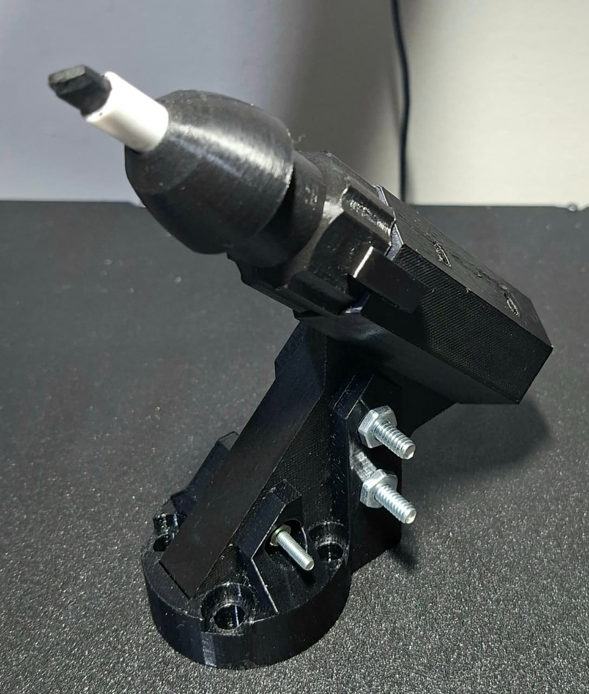
         <em>Figura 2. Vista completa de la herramienta física</em>
      </td>
      <td align="center">
        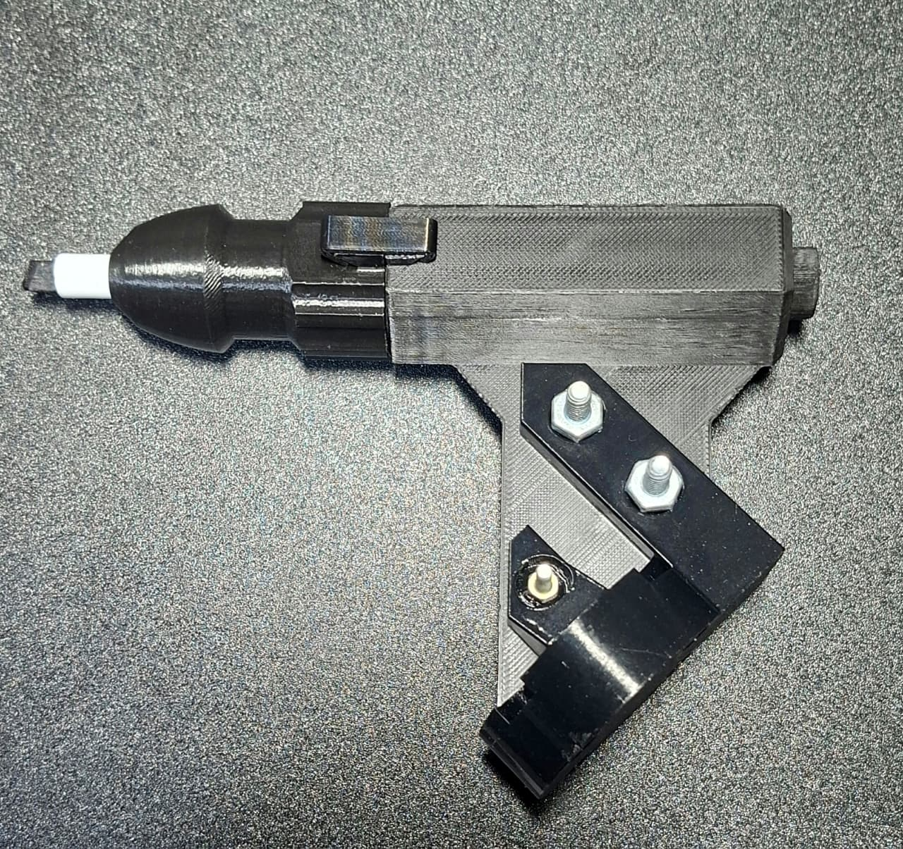
         <em>Figura 3. Vista lateral de la herramienta física</em>
      </td>
      <td align="center">
        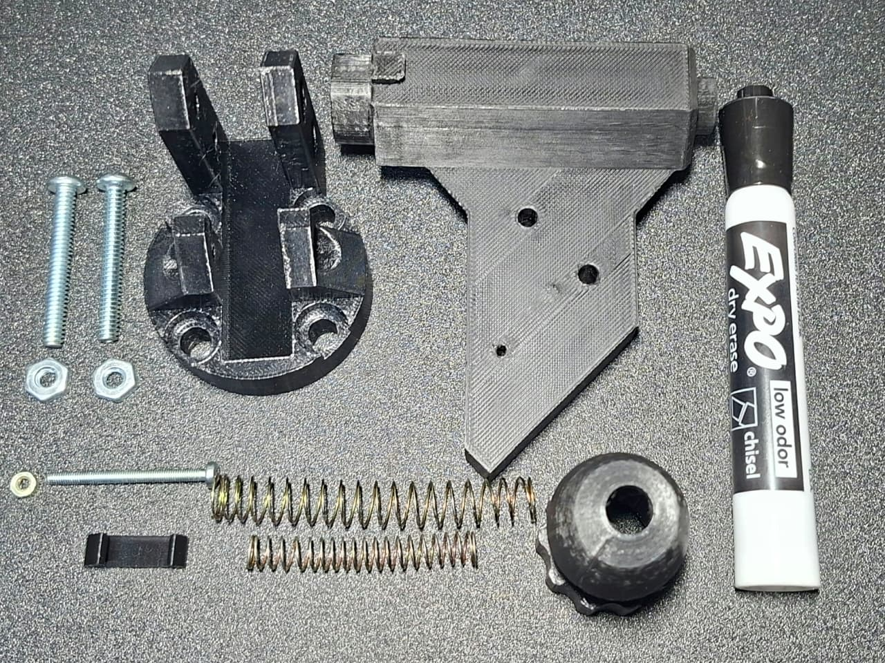
         <em>Figura 4. Detalle de los componentes de la herramienta</em>
      </td>
    </tr>
  </table>

### 2.4 Herramienta física montada en el robot 

  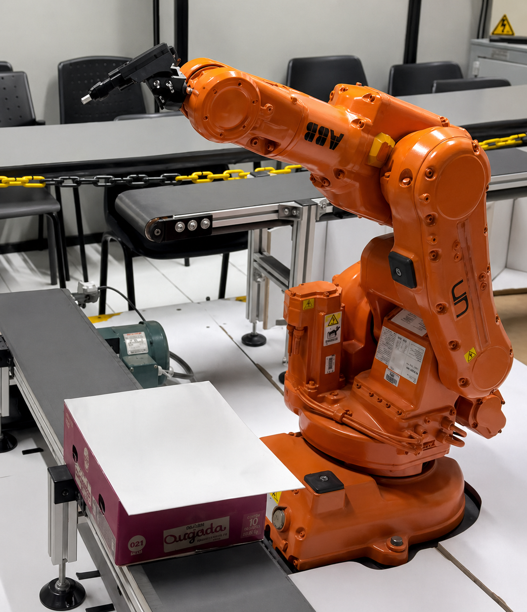
   <em>Figura 3. Herramienta montada en el flange del ABB IRB 140</em>

## 3. Modelado del objeto de trabajo

### 3.1 Diseño y medidas de la caja (torta virtual)

Se diseñó la caja que representa la superficie de la torta en **Autodesk Fusion 360** para asegurar las proporciones correctas. Sobre este espacio virtual se planificó la distribución geométrica para el trazado de los tres nombres de los integrantes del equipo y la figura de un **Pacman**.

  
   <em>Figura 2. Plano de distribución de trayectorias sobre el pastel</em>

## 4. Configuración en RobotStudio

### 4.1 Definición del TCP y Wobj

Con la herramienta y el objeto de trabajo posicionados, se configuró la base del control espacial:
- Se definió el **TCP** (Tool Center Point) virtual asociado a la punta del marcador.
- Se creó el sistema de coordenadas de la pieza o **Workobject** alineado con la caja.

### 4.2 Definición de Targets y trayectorias

Se programaron los *Targets* (puntos de destino) y las trayectorias para asegurar que el robot trazara los caracteres y el Pacman con la interpolación adecuada, verificando que no hubiera colisiones ni singularidades en ninguno de los movimientos.

  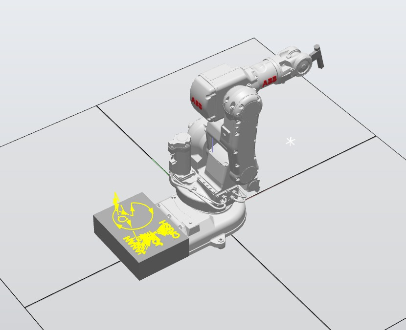
   <em>Figura 3. Targets y trayectorias definidas sobre la caja de trabajo junto al robot ABB IRB 140 en RobotStudio</em>

## 5. Programación en RAPID

### 5.1 Descripción de las funciones utilizadas

A continuación se describen las instrucciones de movimiento RAPID empleadas en el desarrollo de la práctica:

#### Instrucciones de movimiento

| Función | Descripción | Uso en el laboratorio |
|---------|-------------|----------------------|
| `MoveJ` | Movimiento en espacio de juntas (joint space). El robot elige la ruta más directa articulación por articulación. | Desplazamientos rápidos entre posiciones alejadas (Home, puntos previos). |
| `MoveL` | Movimiento lineal en espacio cartesiano. El TCP se desplaza en línea recta. | Trazado de segmentos rectos en las letras. |
| `MoveC` | Movimiento circular en espacio cartesiano. Requiere punto intermedio y punto final. | Trazado de curvas y arcos (letras A, C, D, E, J, N, U y contorno de la figura de Pacman). |

#### Parámetros de velocidad y zona

| Parámetro | Valor | Descripción |
|-----------|-------|-------------|
| `v100` | 100 mm/s | Velocidad de ejecución de todas las trayectorias (requerimiento del laboratorio). |
| `z10` | 10 mm | Zona de suavizado general. El robot no para exactamente en el punto, suaviza la trayectoria con radio 10 mm. |
| `z1` | 1 mm | Zona de suavizado reducida, usada en esquinas pronunciadas (ej: bordes de la boca del Pacman) para mayor precisión. |
| `z100` | 100 mm | Zona amplia usada en el movimiento Home para un retorno fluido. |

#### Instrucciones de E/S digitales

| Función | Descripción |
|---------|-------------|
| `SET <señal>` | Activa (pone en 1) una salida digital. |
| `RESET <señal>` | Desactiva (pone en 0) una salida digital. |
| `WaitTime <t>` | Pausa la ejecución durante `t` segundos. |
| `IF DI_XX = 1 THEN` | Evaluación condicional de una entrada digital. |

### 5.2 Lógica del programa (nombres + Pacman)

El `PROC main()` inicia reseteando las salidas digitales (`DO_01`, `DO_02`, `DO_03`) y entra en un bucle `WHILE TRUE` que evalúa el estado de las entradas digitales para decidir qué rutina ejecutar:
 
- **`DI_01 = 1`, `DI_02 = 0`:** Rutina de decoración completa. Activa `DO_01`, espera 3 segundos para posicionar el pastel en la banda y ejecuta todos los paths de trayectoria en orden (`Path_10` al `Path_142`), que trazan los tres nombres y la figura del Pacman. Al terminar, retorna a Home y activa la banda 2 segundos para retirar el pastel.
- **`DI_01 = 1`, `DI_02 = 1`:** Apoyo físico. Activa `DO_01` y `DO_02`, mueve el robot al punto de referencia de decoración (`Path_11`) como guía para el operario, y apaga los indicadores al finalizar.
- **`DI_02 = 1`, `DI_03 = 0`:** Modo mantenimiento. Activa `DO_02`, desplaza el robot a una zona segura (`Path_42000`) y apaga el indicador al concluir.
- **`DI_03 = 1`, `DI_02 = 0`:** Reinicio de la banda. Activa `DO_03`, espera 3 segundos para el retroceso de la banda y envía el robot a Home (`Path_10`).
- **`DI_02 = 1`, `DI_03 = 1`:** Retorno directo a Home sin ejecutar ninguna rutina adicional.

### 5.3 Código RAPID

👉 **[Código RAPID completo](./Código_RAPID.md)**

---

## 6. Automatización y control

### 6.1 Smart Components (movimiento de la cinta)

Para dotar de realismo a la simulación y emular el proceso de una línea de producción, se configuraron **Smart Components** en RobotStudio. Estos componentes inteligentes permitieron simular la cinemática de la caja desplazándose sobre la banda transportadora, reflejando el comportamiento que tendría el sistema en la vida real.

### 6.2 Station Logic y lógica de tablero

El entorno de *Station Logic* en RobotStudio permitió interconectar las señales digitales del controlador con los Smart Components de la banda transportadora, consolidando una arquitectura de control coherente con el proceso industrial simulado. Cada condición de entrada desencadena una secuencia específica dentro del bucle principal de ejecución:

**Rutina de Decoración (`DI_01`):** Cuando esta entrada se activa, el sistema enciende el indicador luminoso asociado a `DO_01` como señal de operación en curso. A continuación habilita el avance de la banda transportadora, aguarda tres segundos para garantizar el posicionamiento correcto del pastel, despliega la trayectoria completa de decoración y, al concluir, reactiva la banda para retirar el pastel antes de que el manipulador regrese a la posición Home.

**Apoyo Físico / Ubicación (`DI_01` + `DI_02`):** Esta combinación de entradas está orientada al posicionamiento manual del pastel en la celda. El manipulador se desplaza al punto de referencia de decoración para servir como guía visual al operario. Durante toda la intervención, los indicadores `DO_01` y `DO_02` permanecen activos de forma simultánea, advirtiendo que hay presencia humana dentro del área de trabajo.

**Modo Mantenimiento (`DI_02`):** Al detectarse esta entrada de forma individual, el robot se traslada a una zona de acceso seguro y se activa `DO_02` como señal de advertencia. Una vez completado el desplazamiento, el indicador se apaga automáticamente y el sistema retoma el bucle de ejecución continua.

**Reinicio Secuencial (`DI_03`):** Esta entrada implementa una lógica de doble accionamiento para gestionar la posición de la banda transportadora. El primer pulso lleva la banda hasta la zona de decorado; el segundo la regresa a su punto de partida. En ambos casos se activa `DO_03` como indicador de movimiento, y el manipulador es enviado a Home mientras la banda se desplaza en reversa durante tres segundos.

**Retorno Directo a Home (`DI_02` + `DI_03`):** Condición de seguridad que, al pulsarse simultáneamente, ordena el traslado inmediato del manipulador a su posición base sin ejecutar ninguna rutina adicional.

**Gestión de Indicadores (`DO_01`, `DO_02`, `DO_03`):** Las tres salidas digitales cumplen una función de señalización visual del estado del sistema. Su activación permite al operario identificar en todo momento qué rutina está en ejecución, reduciendo el riesgo de intervención involuntaria durante las secuencias de decoración, apoyo y mantenimiento.

---

## 7. Diagrama de flujo de acciones del robot

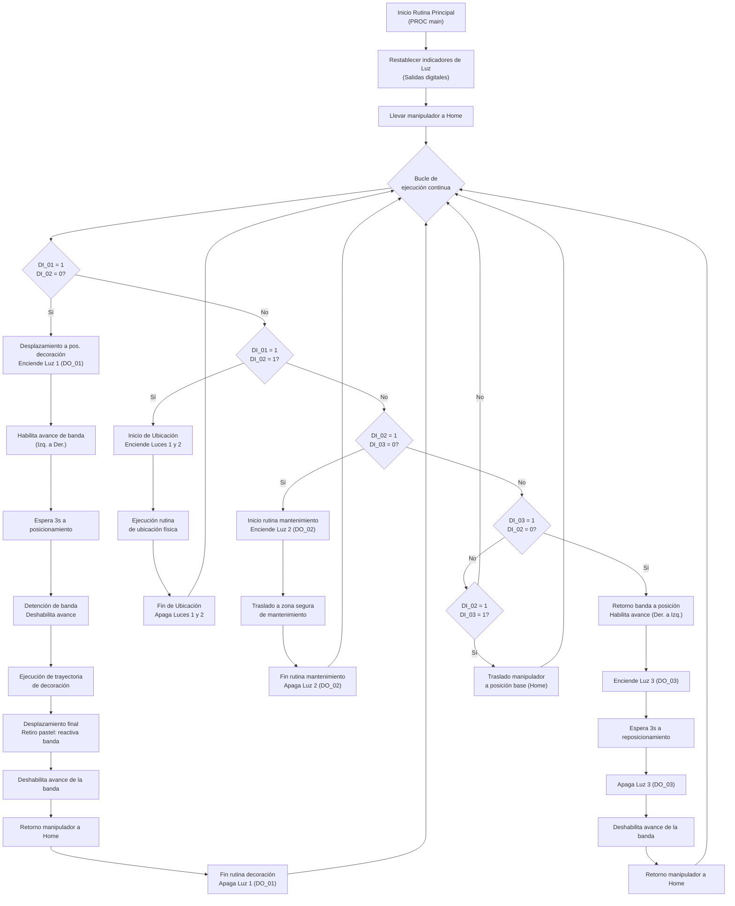

---

## 8. Simulación y resultados

### 8.1 Plano de planta

  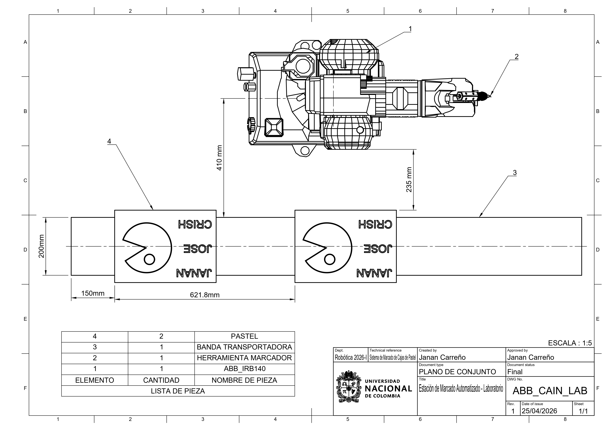
   <em>Figura 5. Plano de planta con la ubicación del robot, banda transportadora y zona de trabajo</em>

El plano muestra la distribución espacial de los elementos del sistema:
- **Robot ABB IRB 140**: posicionado en el centro del área de trabajo.
- **Banda transportadora**: ubicada a un lado del robot, con su eje longitudinal perpendicular al alcance frontal del robot.
- **Zona de decoración (pastel)**: área de trabajo accesible dentro del espacio de trabajo del robot.

### 8.2 Verificación de la simulación en RobotStudio

Se ejecutó la simulación completa comprobando que los Smart Components, las E/S y las trayectorias interactuaran sin colisiones ni errores.

*🎥 Simulación del gemelo digital en RobotStudio*

### 8.3 Resultados obtenidos

Una vez validado en simulación, el código fue transferido al controlador IRC5 físico, donde se realizaron ajustes menores del Workobject debido a las tolerancias de ubicación de la banda transportadora real.

  <table>
    <tr>
      <td align="center">
        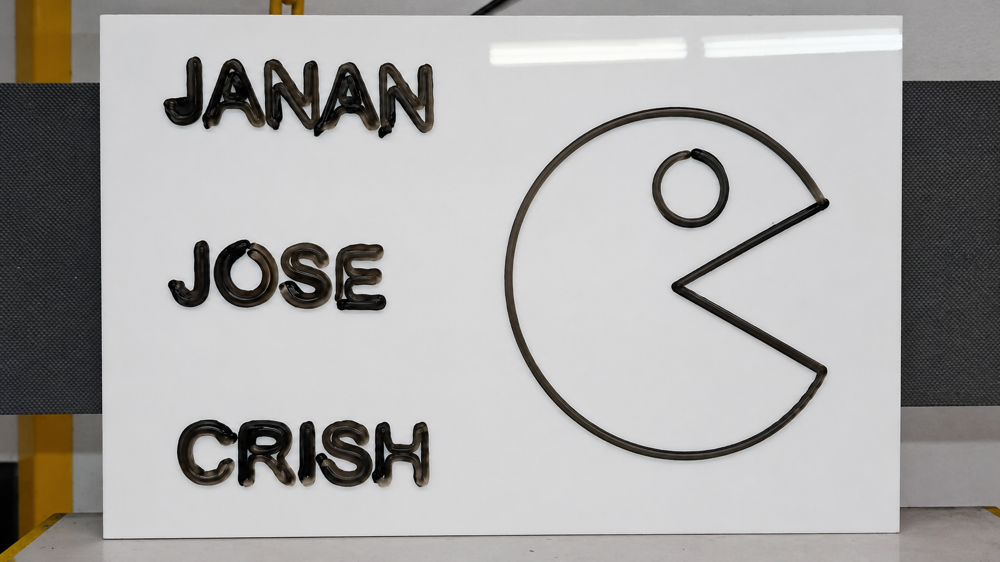
         <em>Figura 6. Resultado final: pastel decorado con los nombres y Pacman</em>
      </td>
      <td align="center">
        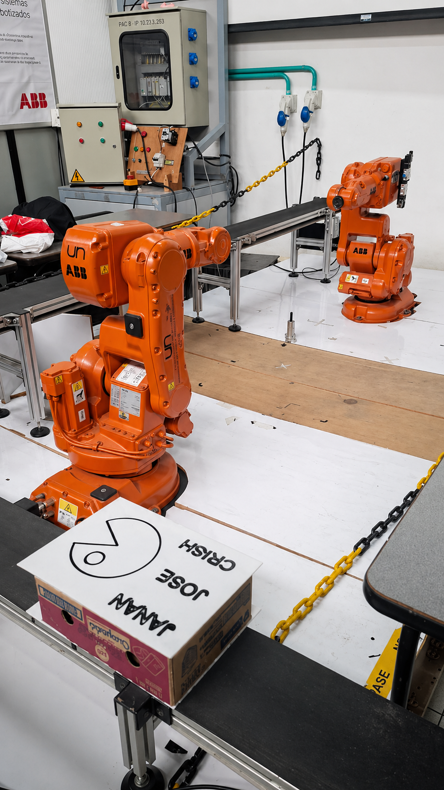
         <em>Figura 7. Pastel sobre la banda transportadora en el laboratorio</em>
      </td>
    </tr>
  </table>

---

### 🎥 Video de ejecución real

*Ejecución real del robot ABB IRB 140 con controlador IRC5*

---

  ← <a href="../README.md">Volver al repositorio principal</a> | <a href="./Código_RAPID.md">Ver código RAPID completo →</a>

