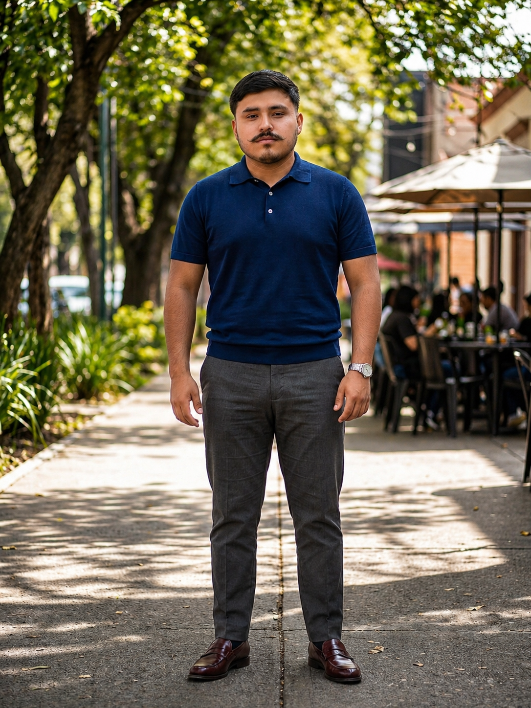
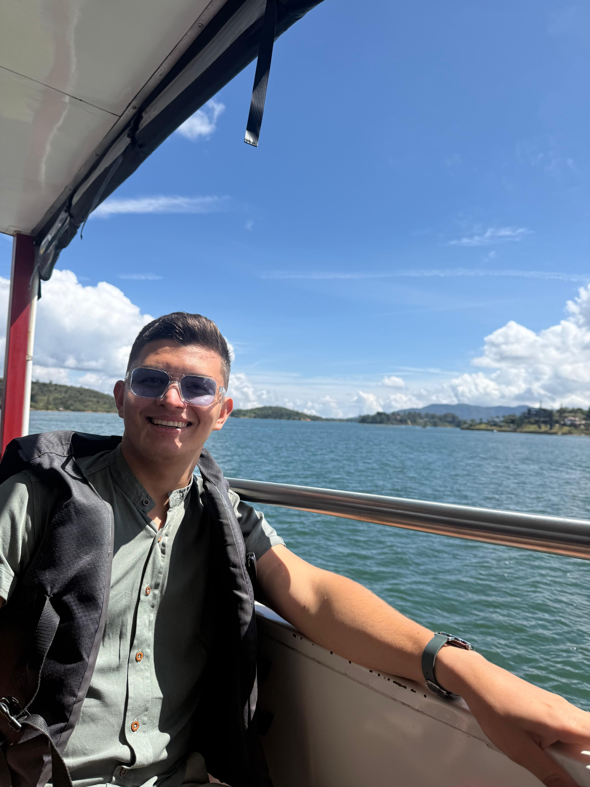
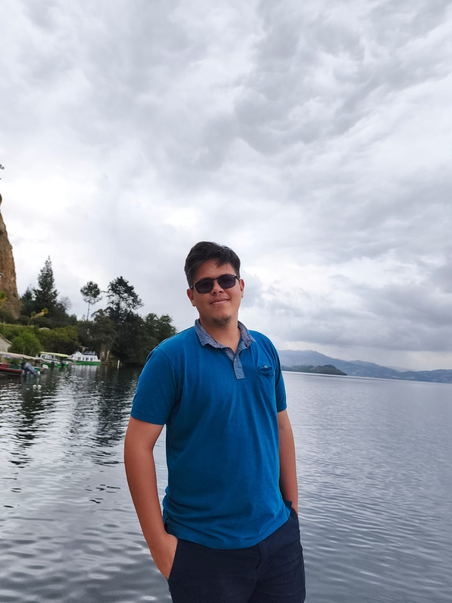

<picture>
    <source srcset="https://imgur.com/5bYAzsb.png" media="(prefers-color-scheme: dark)">
    <source srcset="https://imgur.com/Os03JoE.png" media="(prefers-color-scheme: light)">
    
</picture>

<h3>Curso de Robótica 2026-I</h3>

<h1>Compilado de Informes de Laboratorio de Robótica</h1>

<h2>Profesores: Pedro Fabián Cárdenas Herrera Manuel Felipe Carranza Montenegro</h2>

<h4>Janan Libardo Carreño Riaño Cristian Stiven Hoyos Peralta Jose Andres Zapata Piñeros</h4>

  
  
  
  
  
  
  
  
  
  
  

---

## 🛠️ Resumen del Proyecto

Este repositorio documenta el desarrollo de las actividades del curso de **Robótica 2026-I** de la Universidad Nacional de Colombia. Comprende informes de laboratorio, código fuente, simulaciones y evidencias de los experimentos realizados con distintas plataformas robóticas industriales y de desarrollo.

---

## 🎓 Objetivos Académicos

- Organizar y documentar el desarrollo de los laboratorios del curso.
- Registrar procedimientos, resultados y evidencias experimentales.
- Presentar formalmente a los integrantes del equipo.
- Mantener una estructura clara y reproducible para su evaluación.

---

## 🤝 Equipo de Trabajo

### 👤 Integrante 1

    

  <table align="center">
    <tr><td><b>Nombre</b></td><td>Janan Libardo Carreño Riaño</td></tr>
    <tr><td><b>Carrera</b></td><td>Ingeniería Mecatrónica</td></tr>
    <tr><td><b>Correo</b></td><td><a href="mailto:jacarrenor@unal.edu.co">jacarrenor@unal.edu.co</a></td></tr>
    <tr><td><b>GitHub</b></td><td><a href="https://github.com/JananLC">@JananLC</a></td></tr>
    <tr><td><b>Rol</b></td><td>Programación y simulación</td></tr>
    <tr><td><b>Intereses</b></td><td>🚁 Drones · ⚙️ Automatización · 💻 Programación</td></tr>
  </table>

   

  
<em>Como estudiante de Ingeniería Mecatrónica, mi curiosidad natural me impulsa a explorar y conectar diversas áreas de la tecnología. A través de mi formación, he consolidado habilidades en programación y electrónica aplicada, encontrando una verdadera pasión en el modelado 3D, la simulación y el fascinante mundo de los drones. Me motiva profundamente la integración de procesos y el desarrollo de proyectos que fusionen distintas disciplinas, con un enfoque especial en la automatización y los sistemas de control. Más allá de la ingeniería tradicional, me atrae el análisis de datos como herramienta crítica para entender y descifrar problemáticas sociales y económicas. Soy un fiel creyente del trabajo en equipo y del aprendizaje continuo como motores fundamentales para aportar soluciones prácticas, eficientes e innovadoras en cada proyecto que emprendo.</em>

---

### 👤 Integrante 2

    

  <table align="center">
    <tr><td><b>Nombre</b></td><td>Cristian Stiven Hoyos Peralta</td></tr>
    <tr><td><b>Carrera</b></td><td>Ingeniería Mecatrónica</td></tr>
    <tr><td><b>Correo</b></td><td><a href="mailto:Crhoyosp@unal.edu.co">Crhoyosp@unal.edu.co</a></td></tr>
    <tr><td><b>GitHub</b></td><td><a href="https://github.com/Hoyoscristian">@Hoyoscristian</a></td></tr>
    <tr><td><b>Rol</b></td><td>Documentación, pruebas y modelado 3D</td></tr>
    <tr><td><b>Intereses</b></td><td>⚡ Electrónica · 🎛️ Sistemas de control · 🔩 Mecánica</td></tr>
  </table>

   

  
<em>Como estudiante de Ingeniería Mecatrónica, mi curiosidad me impulsa a explorar la integración de procesos, combinando la electrónica, la mecánica y los sistemas de control. Utilizo la programación y la simulación para desarrollar soluciones automatizadas eficientes. Más allá de la ingeniería, aplico el análisis de datos para entender problemáticas socioeconómicas con un enfoque crítico. Disfruto el trabajo en equipo, el aprendizaje continuo y aportar soluciones prácticas en cada proyecto.</em>

---

### 👤 Integrante 3

    

  <table align="center">
    <tr><td><b>Nombre</b></td><td>Jose Andres Zapata Piñeros</td></tr>
    <tr><td><b>Carrera</b></td><td>Ingeniería Mecatrónica</td></tr>
    <tr><td><b>Correo</b></td><td><a href="mailto:jzapatapi@unal.edu.co">jzapatapi@unal.edu.co</a></td></tr>
    <tr><td><b>GitHub</b></td><td><a href="https://github.com/jzapatapi">@jzapatapi</a></td></tr>
    <tr><td><b>Rol</b></td><td>Modelado 3D, pruebas y simulación</td></tr>
    <tr><td><b>Intereses</b></td><td>🏭 Automatización industrial · 🖨️ Modelado 3D · 📊 Análisis de datos</td></tr>
  </table>

   

  
<em>Soy estudiante de Ingeniería Mecatrónica con formación técnica en mantenimiento electrónico, lo que me ha permitido desarrollar habilidades tanto en programación como en electrónica aplicada. Tengo un fuerte interés en el modelado 3D, la simulación y el desarrollo de proyectos tecnológicos que integren distintas áreas de la ingeniería, especialmente en automatización y sistemas de control. Además, me interesa el análisis de datos y su aplicación en la comprensión de problemáticas sociales y económicas, buscando siempre un enfoque crítico y analítico. Me caracterizo por ser una persona orientada al aprendizaje continuo, con capacidad para trabajar en equipo y aportar soluciones prácticas en el desarrollo de proyectos.</em>

---

## 🖼️ Galería de Evidencias

### ✅ Laboratorio 1: Robótica Industrial ABB IRB140

  
   <em>🤖 Ejecución real &nbsp;&nbsp;&nbsp;&nbsp;|&nbsp;&nbsp;&nbsp;&nbsp; 🖥️ Simulación en RobotStudio</em>

  

  
   <em>🎂 Resultado final: torta decorada</em>

### ⏳ Laboratorio 2: Motoman MH6 y RoboDK

  
<i>🚧 Evidencias en construcción 🚧</i>

### ⏳ Laboratorio 3: EPSON T3 401S y EPSON RC+

  
<i>🚧 Evidencias en construcción 🚧</i>

### ⏳ Laboratorio 4: ROS Jazzy y Turtlesim

  
<i>🚧 Evidencias en construcción 🚧</i>

### ⏳ Laboratorio 5: ROS Jazzy y Phantom Pincher X100

  
<i>🚧 Evidencias en construcción 🚧</i>

### ⏳ Laboratorio 6: Control Servovisual

  
<i>🚧 Evidencias en construcción 🚧</i>

---

## 🧪 Prácticas de Laboratorio

| # | Laboratorio | Robot | Software | Estado |
|---|-------------|-------|----------|--------|
| 01 | [Robótica Industrial: Trayectorias, entradas y salidas digitales](./Laboratorio%20No.%2001%20-%20Rob%C3%B3tica%20Industrial%20ABB%20IRB140%20y%20RobotStudio/) | ABB IRB 140 CAIN | RobotStudio | ✅ Completo |
| 02 | [Robótica Industrial Motoman MH6](./Laboratorio%20No.%2002%20-%20Rob%C3%B3tica%20Industrial%20Motoman%20MH6%20y%20RoboDK/) | Yaskawa Motoman MH6 | RoboDK | 🔄 En progreso |
| 03 | [Robótica Industrial EPSON T3 401S](./Laboratorio%20No.%2003%20-%20Rob%C3%B3tica%20Industrial%20EPSON%20T3%20401S%20y%20EPSON%20RC+/) | EPSON T3 401S | EPSON RC+ | 🔄 En progreso |
| 04 | [ROS Jazzy y Turtlesim](./Laboratorio%20No.%2004%20-%20Rob%C3%B3tica%20de%20Desarrollo%20ROS%20Jazzy%20y%20Turtlesim/) | Turtlesim (virtual) | ROS 2 Jazzy | 🔄 En progreso |
| 05 | [ROS Jazzy y Phantom Pincher X100](./Laboratorio%20No.%2005%20-%20Rob%C3%B3tica%20de%20Desarrollo%20ROS%20Jazzy%20y%20Phantom%20Pincher%20X100/) | Phantom Pincher X100 | ROS 2 Jazzy | 🔄 En progreso |
| 06 | [Control Servovisual](./Laboratorio%20No.%2006%20-%20Rob%C3%B3tica%20de%20Desarrollo%20ROS%20Jazzy%20y%20Control%20Servovisual/) | Phantom Pincher X100 | ROS 2 Jazzy + OpenCV | 🔄 En progreso |

---

## 📜 Licencia

Este repositorio está bajo la licencia especificada en el archivo [LICENSE](./LICENSE).

---

  Universidad Nacional de Colombia · Facultad de Ingeniería · Departamento de Ingeniería Mecánica y Mecatrónica · 2026-I

